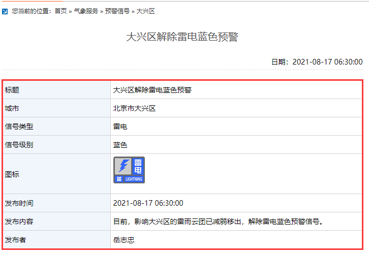

## 1. 总体说明

### 环境依赖

* 语言： Python3.7
* 第三方依赖包：requests
* 网络：互联网

### 数据来源

气象预警数据来源自北京市气象局网站 [http://bj.cma.gov.cn/](http://bj.cma.gov.cn/)

具体来源：

* 北京市气象预警：[http://bj.cma.gov.cn/qxfw/yjxx/bjs/](http://bj.cma.gov.cn/qxfw/yjxx/bjs/)
* 大兴区气象预警：[http://bj.cma.gov.cn/qxfw/yjxx/dxq/](http://bj.cma.gov.cn/qxfw/yjxx/dxq/)


如下图，通过爬虫程序从以上链接（页面）中抓取下图所示部分的数据。<br>
包括标题、城市、信号类型、信号级别、发布时间、发布内容、发布人



## 2. 爬虫逻辑

通过审查页面 HTTP 请求，可以确认以上述页面中的数据都来源于以下的回调：

北京市：http://101.200.145.109:8087/weather/scene/warningPage.do?callback=cb6&pageNo=1&doc=北京市&_=1629168887578
大兴区：http://101.200.145.109:8087/weather/scene/warningPage.do?callback=cb6&pageNo=1&doc=大兴区&_=1629171491467

以上连接的响应示例：

```json
cb6({"current":"1","total":34,"value":[{"channelname":"大兴区","cttime":"2021-08-17 06:30:00","id":10540,"title":"大兴区解除雷电蓝色预警"},{"channelname":"大兴区","cttime":"2021-08-17 01:35:00","id":10528,"title":"大兴区解除暴雨黄色预警"},{"channelname":"大兴区","cttime":"2021-08-16 22:35:00","id":10509,"title":"大兴区解除大风蓝色预警"},{"channelname":"大兴区","cttime":"2021-08-16 21:50:00","id":10503,"title":"大兴区发布暴雨黄色预警"},{"channelname":"大兴区","cttime":"2021-08-16 21:25:00","id":10497,"title":"大兴区发布暴雨蓝色预警"},{"channelname":"大兴区","cttime":"2021-08-16 21:25:00","id":10499,"title":"大兴区发布大风蓝色预警"},{"channelname":"大兴区","cttime":"2021-08-16 20:00:00","id":10471,"title":"大兴区发布雷电蓝色预警"},{"channelname":"大兴区","cttime":"2021-08-16 07:05:00","id":10447,"title":"大兴区解除雷电黄色预警"},{"channelname":"大兴区","cttime":"2021-08-15 14:40:00","id":10423,"title":"大兴区发布雷电黄色预警"},{"channelname":"大兴区","cttime":"2021-08-15 08:50:00","id":10403,"title":"大兴区解除雷电黄色预警"},{"channelname":"大兴区","cttime":"2021-08-14 19:50:00","id":10348,"title":"大兴区发布雷电黄色预警"},{"channelname":"大兴区","cttime":"2021-08-14 08:50:00","id":10325,"title":"大兴区发布雷电蓝色预警"},{"channelname":"大兴区","cttime":"2021-08-13 23:20:00","id":10308,"title":"大兴区发布雷电蓝色预警"},{"channelname":"大兴区","cttime":"2021-08-12 18:45:00","id":10275,"title":"大兴区解除雷电蓝色预警"},{"channelname":"大兴区","cttime":"2021-08-12 07:30:00","id":10258,"title":"大兴区发布雷电蓝色预警"}]})
```

在以上页面中可以得到当天各个预警信息的 id，将这个 id 代入到以下链接中再发送请求，则可以得到预警的详情信息：

北京市预警详情：http://101.200.145.109:8087/weather/scene/warningbyid.do?callback=cb6&doc={id}&_=1629187438276
大兴区预警详情：http://101.200.145.109:8087/weather/scene/warningbyid.do?callback=cb6&doc={id}&_=1629187258213

预警详情响应示例：

```json
cb6({"channelname":"大兴区","cttime":"2021-08-17 06:30:00","id":10540,"mainbody":"{\"city\":\"北京市大兴区\",\"image\":\"leidianlanse\",\"pubbody\":\"目前，影响大兴区的雷雨云团已减弱移出，解除雷电蓝色预警信号。\",\"pubtime\":\"2021-08-17 06:30:00\",\"pubuser\":\"岳志忠\",\"signclass\":\"雷电\",\"signrank\":\"蓝色\",\"title\":\"大兴区解除雷电蓝色预警\"}","title":"大兴区解除雷电蓝色预警"})
```

通过简单的字符串处理，可以将以上两个响应内容处理成标准的 json 格式再进行解析即可以取到相应的数据

北京市及大兴区的预报数据都以同样的方式获取，最终入库。


## 3. 代码说明

程序整体框架如下：

```python
class WeatherWarning:
    def __init__(self):
        pass
    def update_header(self, headers):
        pass
    def send_request(self, url):
        pass
    def get_id(self, response):
        pass
    def parse_detail(self, response):
        pass
    def drop_partition(self, tb_name, pt_str, project='sjzt_stg'):
        pass
    def write2odps(self, data, tb_name, pt_str, project='sjzt_stg'):
        pass

def run():
    pass

if __name__ == '__main__':
    run()
```

程序从最底下的 `run()` 开始，进入到 `def run()` 内部。
`run()` 函数定义了 HTTP 请求头、URL、结果表、结果表分区。
并实例化主类 `WeatherWarning` ，调用类方法依次获取预警 ID、根据预警 ID 获取预警详情、删除结果表已有分区、把结果写入到 MaxCompute 表

### WeatherWarning 类说明

#### __init__

初始化函数，获取 HTTP 会话对象，同一个城市（北京或大兴）发请求时使用同一个会话

#### update_header

更新请求头。为了模拟真实请求而做

#### send_request

发送 HTTP 请求，返回响应报文正文。包括获取 ID 及获取预警详情的请求都通过这个方法实现

#### get_id

获取预警 ID，返回 ID 列表

#### parse_detail

解析预警详情信息，返回由预警信息各部分内容组成的列表

#### drop_partition

删除表中已有的分区。因为 MaxCompute 的 python sdk 不提供类似于 sql 中的 `insert overwrite` 方法，只能先删除原有分区再写入以达到覆盖更新

#### write2odps

将结果数据写入到 MaxCompute 表中

## 4. 部署

程序目前位于 **sjzt_stg** 项目下，业务流程：亦庄城市大脑 -> MaxCompute -> 数据开发 -> weather_warning.py

每 1 小时执行一次
