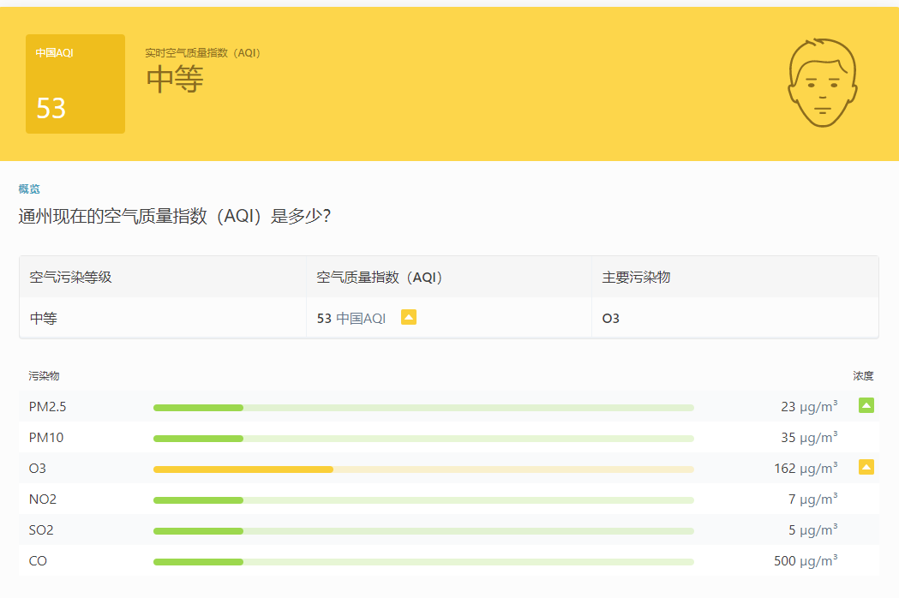

## 1. 总体说明

### 环境依赖

* 语言： Python3.7
* 第三方依赖包：requests
* 网络：互联网

### 数据来源

气象预警数据来源自IQAir网站 [https://www.iqair.cn/](https://www.iqair.cn/)

具体来源：

* 北京：https://www.iqair.cn/cn/china/beijing
* 亦庄：https://www.iqair.cn/cn/china/beijing/yizhuang-bda
* 大兴：https://www.iqair.cn/cn/china/beijing/daxing
* 通州：https://www.iqair.cn/cn/china/beijing/tongzhou
* 丰台云岗：https://www.iqair.cn/cn/china/beijing/fengtai-yungang
* 丰台小屯：https://www.iqair.cn/cn/china/beijing/fengtai-xiaotun


如下图，通过爬虫程序从以上链接（页面）中抓取下图所示部分的数据。<br>
包括更新时间、AQI数值、质量指数级别、污染物详细指标等



## 2. 爬虫逻辑

前述数据全部都在页面的 HTML 源码中，其中

* 更新时间位于 `<time _ngcontent-airvisual-web-c158></time>` 标签中
* AQI 指标值为于 `<p _ngcontent-airvisual-web-c170="" class="aqi-value__value"></p>` 标签中
* 级别位于 `<span _ngcontent-airvisual-web-c170="" class="aqi-status__text"></span>` 标签中
* 污染物详情位于 `<table _ngcontent-airvisual-web-c170="" class="aqi-overview-detail__other-pollution-table"></table>` 标签中

不过上述的 `_ngcontent-airvisual-web-c170` 属性可能在不同的页面不同，因此代码逻辑是先提取这个值，再用这个值去做正则匹配（筛选）。

通过正则表达式一步步缩小范围，最终取到需要的内容。数据最入都保存在一张表中：`sjzt_stg.stg_kqzl_aqi_df`


## 3. 代码说明

程序整体框架如下：

```python
class Iqair:
    def __init__(self):
        pass
    def update_header(self, headers):
        pass
    def send_request(self, url):
        pass
    def parse_detail(self, response):
        pass
    def drop_partition(self, tb_name, pt_str, project='sjzt_stg'):
        pass
    def write2odps(self, data, tb_name, pt_str, project='sjzt_stg'):
        pass

def run():
    pass

if __name__ == '__main__':
    run()
```

程序从最底下的 `run()` 开始，进入到 `def run()` 内部。
`run()` 函数定义了 HTTP 请求头、URL、结果表、结果表分区。
并实例化主类 `Iqair` ，循环遍历所有需要抓取数据的地址（本例中为5个），发起请求、解析页面得到数据，删除结果表已有分区、把结果写入到 MaxCompute 表

### Iqair 类说明

#### __init__

初始化函数，获取 HTTP 会话对象，发送不同地区的请求时使用同一个会话

#### update_header

更新请求头。为了模拟真实请求而准备

#### send_request

发送 HTTP 请求，返回响应报文正文。

#### parse_detail

解析 HTML 源码，通过正则表达式进行匹配

#### drop_partition

删除表中已有的分区。因为 MaxCompute 的 python sdk 不提供类似于 sql 中的 `insert overwrite` 方法，只能先删除原有分区再写入以达到覆盖更新

#### write2odps

将结果数据写入到 MaxCompute 表中

## 4. 部署

程序目前位于 **sjzt_stg** 项目下，业务流程：亦庄城市大脑 -> MaxCompute -> 数据开发 -> weather_warning.py

每 1 小时执行一次
