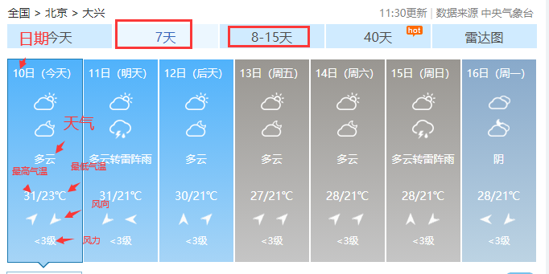
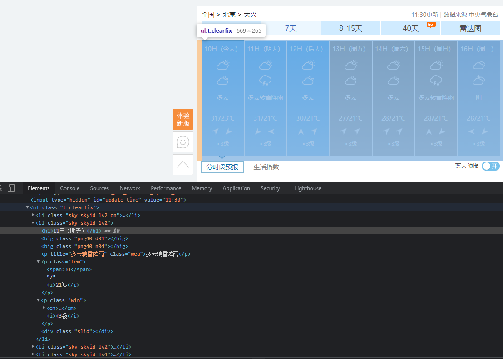

## 1. 总体说明

### 环境依赖

* 语言： Python3.7
* 第三方依赖包：requests
* 网络：互联网

### 数据来源

天气预报数据来源自中国天气网 [http://www.weather.com.cn/](http://www.weather.com.cn/)

具体来源：

* 北京天气：[http://www.weather.com.cn/weather/101010100.shtml](http://www.weather.com.cn/weather/101010100.shtml)
* 大兴天气：[http://www.weather.com.cn/weather/101011100.shtml](http://www.weather.com.cn/weather/101011100.shtml)

如下图，通过爬虫程序从以上链接（页面）中抓取下图所示部分的数据。<br>
包括从今天起及未来14天（共15天）的日期、预期天气、最高气温、最低气温、风向、风力、更新时间



## 2. 爬虫逻辑

程序通过解析页面的 HTML 代码，使用正则表达式匹配的方式从源码中获取到需要的数据。<br>
如下图所示



7 天的预报数据都包含在 `class="t clearfix"` 的 `ul` 标签内。

* 解析 `h1` 标签可以获取日期值
* 解析 `class="wea"` 标签可以取得天气预报文本
* 解析 `class="tem"` 标签可以取得最高气温及最低气温数据
* 解析 `class="win"` 标签可以取得风向及风力数据

8-15 天的预报数据逻辑类似，将“7天”及“8-15天”的数据合并在一起即可得到 15 天的天气预报数据。

更新时间包含在一个 `id="update_time"` 的隐藏标签内：
```html
<input type="hidden" id="update_time" value="07:30"/>
```

北京市及大兴区的预报数据都以同样的方式获取，最终入库。


## 3. 代码说明

程序整体框架如下：

```python
class WeatherForecast:
    def __init__(self):
        pass
    def update_header(self, headers):
        pass
    def parse_7d(self, response):
        pass
    def parse_15d(self, response):
        pass
    def parse_html(self, response, date_range):
        pass
    def drop_partition(self, tb_name, pt_str, project='sjzt_stg'):
        pass
    def write2odps(self, data, tb_name, pt_str, project='sjzt_stg'):
        pass

def run():
    pass

if __name__ == '__main__':
    run()
```

程序从最底下的 `run()` 开始，进入到 `def run()` 内部。
`run()` 函数定义了 HTTP 请求头、URL、结果表、结果表分区。
并实例化主类 `WeatherForcast` ，调用类方法依次删除结果表现有分区、获取页面 HTML 代码、解析 HTML 代码、把结果写入到 MaxCompute 表

### WeatherForecast 类说明

#### __init__

初始化函数，获取 HTTP 会话对象，同一个城市（北京或大兴）发请求时使用同一个会话

#### update_header

更新请求头。为了模拟真实请求而做

#### parse_7d

解析 7 天的 HTML 页面代码，获取需要的天气预报数据

#### parse_15d

解析 8-15 天的 HTML 页面代码，获取需要的天气预报数据

#### parse_html

将解析 7 天和 8-15 天的函数做封装，根据传进来的的日期值自动选择对应的方法

#### drop_partition

删除表中已有的分区。因为 MaxCompute 的 python sdk 不提供类似于 sql 中的 `insert overwrite` 方法，只能先删除原有分区再写入以达到覆盖更新

#### write2odps

将结果数据写入到 MaxCompute 表中

## 4. 部署

程序目前位于 **sjzt_stg** 项目下，业务流程：亦庄城市大脑 -> MaxCompute -> 数据开发 -> weather_forecast.py

每 30 分钟执行一次
